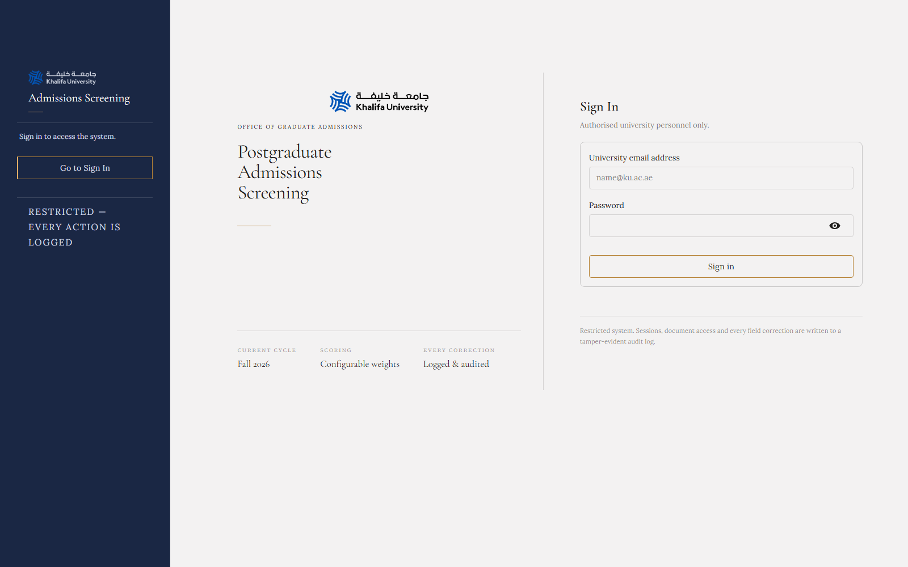
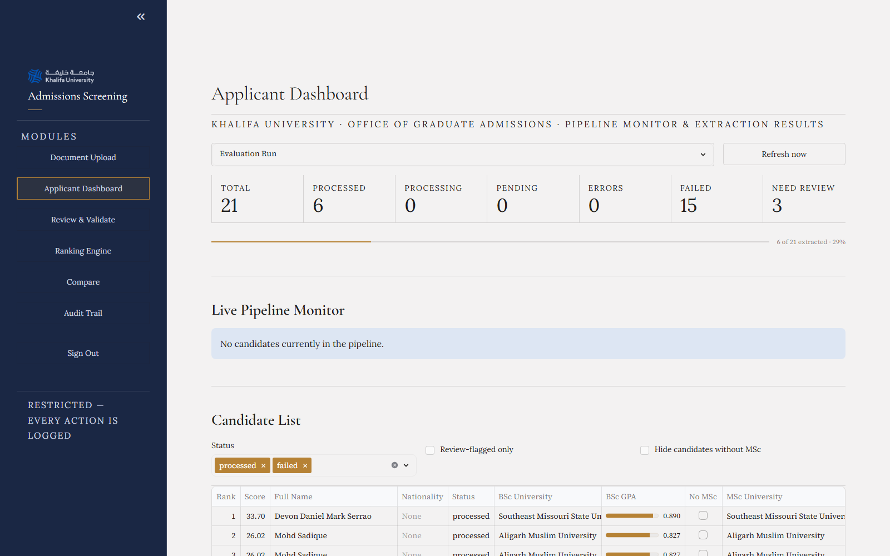
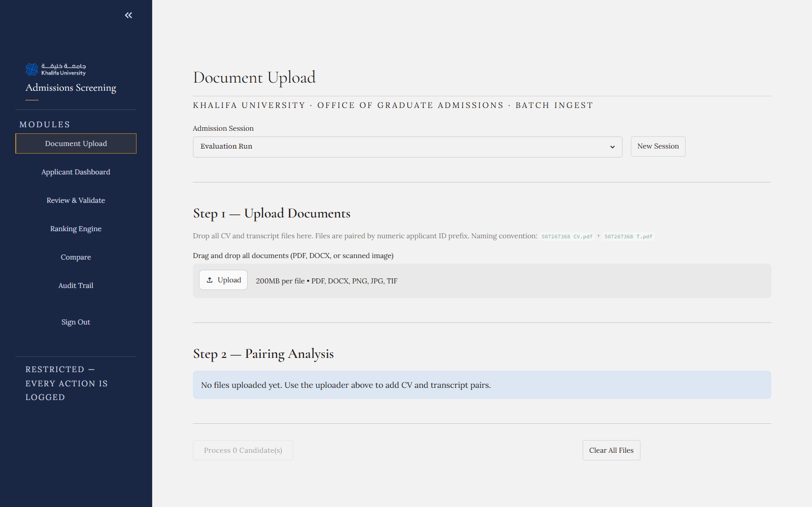
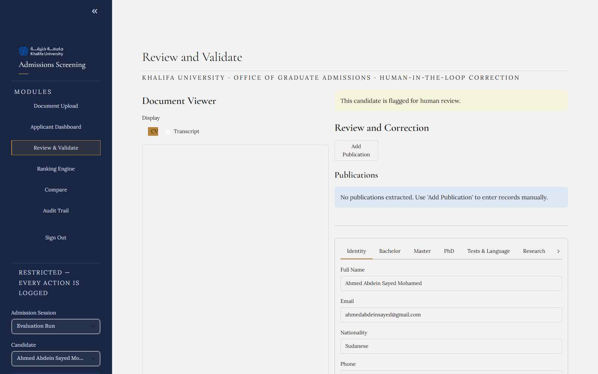
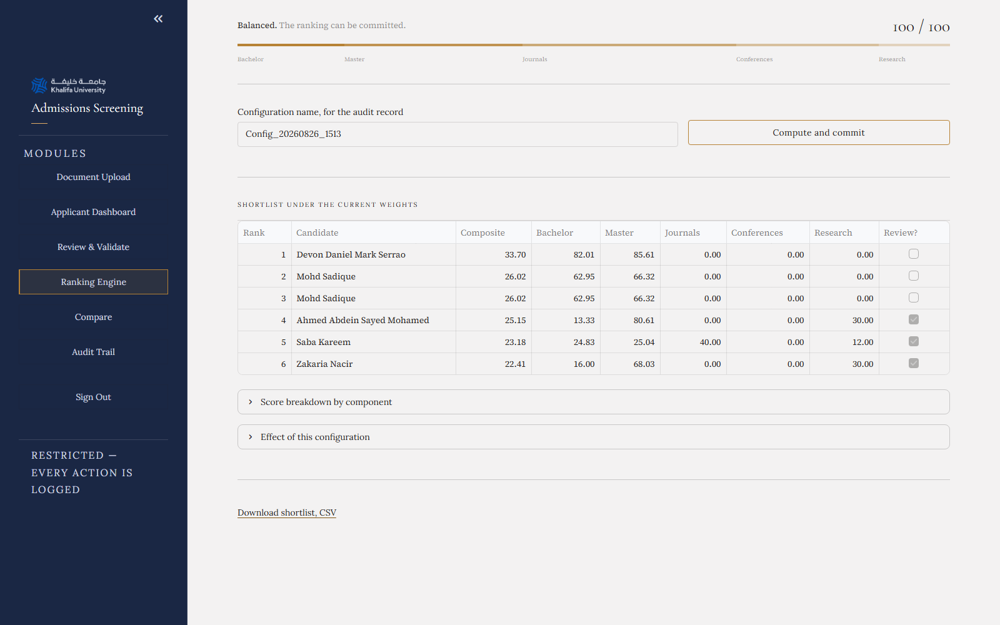
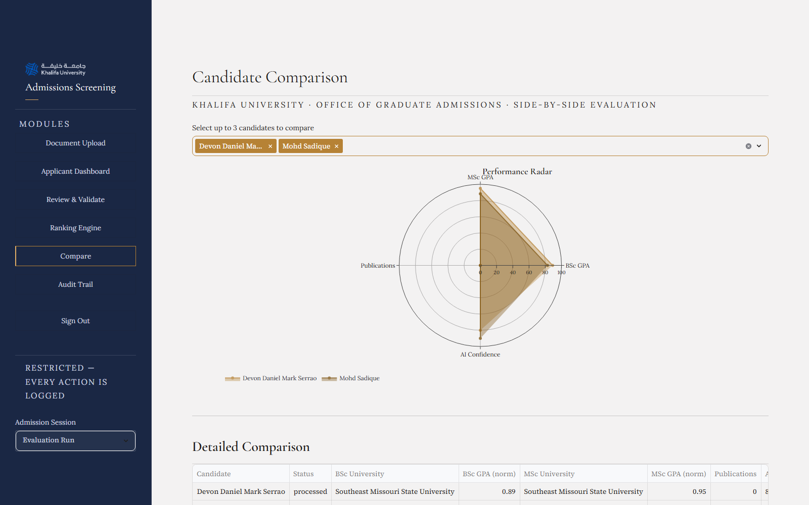
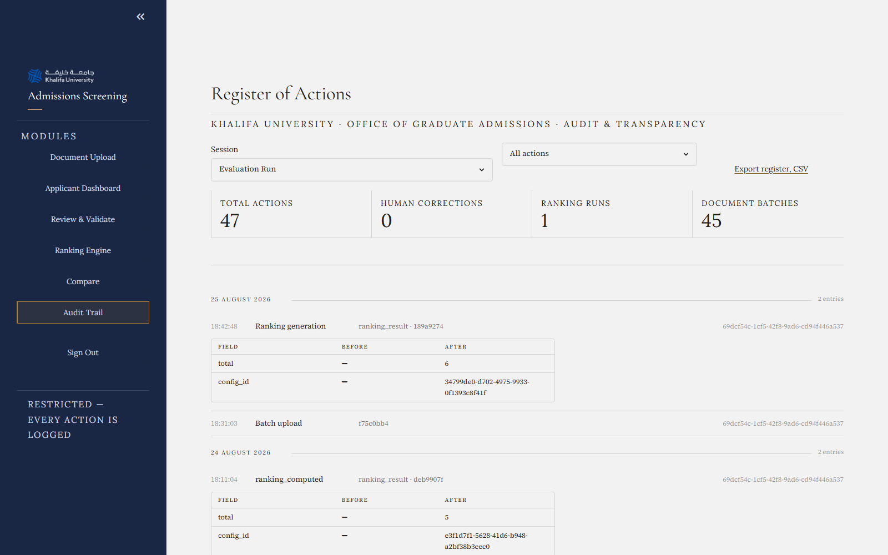

# PG Screening System

AI-assisted screening and ranking platform for postgraduate (PhD/MSc) applicants. Admissions staff upload each applicant's **CV + transcript**, the system extracts structured academic data with an LLM, cross-validates it, scores each applicant against configurable weighted criteria, and produces a ranked shortlist for the admissions committee.

Built for Khalifa University's admissions screening ("KU Admission Screening — AI-Assisted Postgraduate Evaluation System"). Docker container names use the `pgars-*` prefix (PG Applicant Ranking System).

## Demo access

For reviewing the running instance:

| Field | Value |
|---|---|
| URL | http://localhost:8501 |
| Email | `admin@ku.ac.ae` |
| Password | `admin123` |

This is a local demo account for evaluation only — change it before any real deployment (`docker compose exec backend python -m backend.app.create_admin`, or update the `users` table directly).

## A note on LLM API limits

The extraction pipeline runs on **Groq**, selected via `GROQ_API_KEY`/`GROQ_API_KEYS` and `LLM_PROVIDER=groq` in `.env`. The key used for this project's testing/demo is a **free-tier key**, which caps how many tokens can be processed **per day** (TPD) — once that cap is hit, extraction for new candidates stalls until Groq resets the quota at midnight UTC.

The code already handles this as gracefully as a free tier allows: `src/ai/groq_service.py` supports **multiple comma-separated keys** in `GROQ_API_KEYS`, rotating to the next key and putting an exhausted one on a 24h cooldown rather than failing outright. But on one key (or a handful), a batch of many candidates back-to-back can still exhaust the daily quota.

**A paid Groq API key removes this ceiling** and is the recommended setup for anything beyond light testing — a real admissions cycle, live demos, or batch-processing many candidates in one sitting. No code changes are needed: generate the key from a billed Groq account and drop it into `GROQ_API_KEY` (or `GROQ_API_KEYS`) in `.env`, then restart the backend/Celery containers.

*(`src/ai/anthropic_fallback.py` exists in the codebase as a second cloud-provider option but is not currently wired into the pipeline — `src/ai/llm_factory.py` only switches between `groq` and `ollama` via `LLM_PROVIDER`. Connecting it as an automatic fallback when Groq's daily quota is hit would be a natural next step, but is not active today.)*

## Contents

- [Demo access](#demo-access)
- [A note on LLM API limits](#a-note-on-llm-api-limits)
- [Screenshots](#screenshots)
- [Architecture](#architecture)
- [Tech stack](#tech-stack)
- [Repository layout](#repository-layout)
- [Data model](#data-model)
- [Extraction pipeline](#extraction-pipeline)
- [Evaluation results](#evaluation-results)
- [Scoring & ranking](#scoring--ranking)
- [API reference](#api-reference)
- [Frontend (Streamlit)](#frontend-streamlit)
- [Setup & running locally](#setup--running-locally)
- [Configuration reference](#configuration-reference)
- [Observability](#observability)
- [Security notes](#security-notes)
- [Testing & quality assurance](#testing--quality-assurance)
- [Known limitations](#known-limitations)

## Screenshots

| | |
|---|---|
| **Sign In** — restricted access, every action logged | **Applicant Dashboard** — pipeline monitor, KPI ledger, extraction inspector |
|  |  |
| **Document Upload** — batch CV/transcript ingest with auto-pairing | **Review & Validate** — human-in-the-loop correction, side-by-side document viewer |
|  |  |
| **Ranking Engine** — configurable composite weights, computed shortlist | **Compare** — side-by-side candidate radar chart |
|  |  |
| **Audit Trail** — tamper-evident, append-only action register | |
|  | |

## Architecture

```
┌─────────────┐      upload CV+transcript      ┌──────────────────┐
│  Streamlit  │ ───────────────────────────────▶│  FastAPI backend │
│  frontend   │◀─────────────────────────────── │  (REST API)      │
└─────────────┘        JSON responses            └────────┬─────────┘
                                                            │ enqueue task
                                                            ▼
┌──────────────┐   SQLAlchemy (async)      ┌───────────────────────┐
│  PostgreSQL  │◀──────────────────────────│  Celery worker(s)     │
│  (data)      │──────────────────────────▶│  screening_pipeline   │
└──────────────┘                            └──────────┬────────────┘
                                                          │
                          ┌───────────────────────────────┼───────────────────────┐
                          ▼                                ▼                       ▼
                 Docling / PyMuPDF /                 LLM extraction         QS rank, Scopus,
                 python-docx / Tesseract /            (Groq or Ollama,      CORE, DOI lookups
                 VLM OCR (ingestion)                  via LLM_PROVIDER)     (data/*.csv, network)
```

- **Celery + Redis** decouple document ingestion/LLM extraction (slow, I/O and API-bound) from the request/response cycle. `celery_beat` runs scheduled jobs.
- **Redis** is also used as a distributed lock (`SET NX EX`) so two workers never process the same applicant concurrently.
- Everything runs via **Docker Compose** (`docker-compose.yml`): `postgres`, `redis`, `backend`, `celery_worker`, `celery_beat`, `streamlit`.

## Tech stack

| Layer | Technology |
|---|---|
| API | FastAPI + Uvicorn, JWT auth (`python-jose`), rate limiting (`slowapi`) |
| Async DB | SQLAlchemy 2.0 (async) + `asyncpg`, Alembic migrations |
| Task queue | Celery 5 + Redis (broker/result backend + locking) |
| Frontend | Streamlit (multi-page app) |
| Document parsing | Docling (preferred), PyMuPDF, `python-docx`, Tesseract OCR, VLM vision OCR (Groq) |
| LLM extraction | Groq (cloud, default) or Ollama (on-prem), switched via `LLM_PROVIDER` |
| Data enrichment | QS World University Rankings, Scimago/Scopus journal percentiles, CORE conference rankings (CSV files in `data/`), CrossRef DOI verification |
| Monitoring | `prometheus-client`, `/metrics` endpoint, Grafana-style alert rules (`monitoring/alerts.yml`) |
| DB | PostgreSQL 16 |

## Repository layout

```
backend/app/            FastAPI app
  api/v1/                  Route modules: upload, applicants, ranking, files,
                            audit, sessions, auth, monitoring, supervisors
  db/                       SQLAlchemy models, async session, repositories/ (one per entity)
  services/                 extraction_service, ranking_service (orchestrate repos + pipeline)
  tasks.py                  Celery app + process_documents_task
  main.py                   FastAPI app factory, CORS, router registration

src/                     Core domain logic, imported by both backend and Celery workers
  ingestion/                PDF/DOCX readers, Docling wrapper, VLM OCR, storage, validator
  preprocessing/            cleaner, segmenter (CV → education/publications chunks), sanitizer (lang detect)
  ai/                       llm_factory (Groq/Ollama provider switch), groq_service,
                            llm_service (Ollama), anthropic_fallback (unwired), ocr
  extractors/                university_extractor (QS lookup), publication_extractor (Scopus/CORE
                            enrichment), gpa_extractor, doi_verifier
  models/                   Pydantic extraction schemas (ExtractedCandidate), applicant_metrics
  scoring/                   config (RankingConfig), engine (compute_score), normalizer, ranker
  pipeline/                  screening_pipeline.py — the end-to-end orchestration (see below)
  monitoring/                Prometheus metric definitions

streamlit_app/           Multi-page admin/evaluator UI (1_upload → 6_audit)
alembic/                 DB migrations
config/scoring_weights.yaml   Sub-component scoring constants (GPA/QS split, decay factors, etc.)
data/                    Reference CSVs: QS rankings, Scimago/Scopus, CORE conferences
scripts/                 generate_ground_truth.py, run_evaluation.py, validate_extraction.py
                          (offline extraction-accuracy tooling)
monitoring/alerts.yml    Prometheus alert rules
docker-compose.yml       Full local/prod stack definition
```

## Data model

Core tables (`backend/app/db/models.py`), all PostgreSQL with UUID primary keys:

- **`users`** — admins / evaluators, bcrypt password hash, `role` (`admin` | `evaluator`).
- **`evaluation_sessions`** — an admissions cycle (e.g. "Fall 2026"), tied to a `qs_year`.
- **`applicants`** — one per candidate, linked to a session, status (`pending` → `processing` → `processed`/`failed`), retry tracking, `needs_human_review` flag, last computed score/rank.
- **`documents`** — uploaded files (CV/transcript), storage path, SHA-256 hash (dedup detection), OCR quality score.
- **`extracted_metrics`** — one row per applicant: BSc/MSc/PhD university + QS rank + GPA (raw value + original scale, plus a normalised 0–1 fraction for cross-university comparison) + field/country/year, GRE/IELTS/TOEFL scores, work experience, research interests, awards, extraction confidence and review-reason detail (JSONB).
- **`venues`** + **`publications`** — deduplicated publication venues (journal/conference) with Scopus percentile/quartile or CORE ranking, and each applicant's publications with author position, contribution score, DOI, extraction source.
- **`ranking_configs`** — named, per-session sets of composite weights (JSONB) + optional tiebreak field.
- **`ranking_results`** — a computed ranking run: full scored snapshot (JSONB) for audit/reproducibility.
- **`manual_overrides`** — human corrections to any extracted field, with reason and old/new values.
- **`supervisor_profiles`** + **`applicant_supervisor_matches`** — faculty profiles with research areas and Jaccard-similarity matches against applicant research interests.
- **`audit_log`** — append-only action log (who did what, old/new state, IP, timestamp).

## Extraction pipeline

`src/pipeline/screening_pipeline.py::run_pipeline_logic()` runs inside a Celery task per applicant. High-level flow:

1. **Guard rails** — skip if already `processed`, fail if `retry_count >= 5`, acquire a Redis lock (`pipeline:lock:{applicant_id}`, fails open if Redis is down) so concurrent workers can't double-process the same applicant.
2. **Document reading** (offloaded to a thread pool so it never blocks the event loop), with an extraction cascade:
   - Standalone images → Groq VLM vision OCR → Tesseract fallback.
   - DOCX → Docling (if available) → `python-docx`.
   - Native (text) PDF → Docling → PyMuPDF, quality scored from average chars/page.
   - Scanned PDF → PyMuPDF + Tesseract, upgraded to VLM vision OCR if Tesseract quality < 0.50.
   - All storage paths are validated against `STORAGE_ROOT` to block path traversal.
3. **Cleaning & segmentation** — `DocumentCleaner` normalises text, `DocumentSegmenter` splits the CV into education/publications sections to keep LLM prompts focused.
4. **Language detection** on the CV (multilingual prompt support).
5. **LLM extraction** — `get_llm_orchestrator()` (`src/ai/llm_factory.py`) selects Groq or Ollama per `LLM_PROVIDER`. On Groq, `GroqOrchestrator.extract_parallel()` rotates across multiple `GROQ_API_KEYS` and puts a key on a 24h cooldown when it hits its daily token quota, rather than failing the whole batch. Output validated against the `ExtractedCandidate` Pydantic schema.
6. **Cross-validation & quality checks**:
   - Regex-based GPA cross-check between the LLM-extracted GPA and patterns found directly in the transcript text; flags `gpa_mismatch` if they diverge by >10%.
   - **Misfile detection** — checks whether the extracted candidate name actually appears in the transcript header; caps confidence at 0.3 and flags `possible_misfile` if not.
   - Duplicate-file detection via SHA-256 hash comparison across applicants.
   - **DOI verification** against CrossRef for any publication DOIs found.
7. **University ranking lookup** — fuzzy-matches BSc/MSc/PhD university names against QS World Rankings (`data/qs_rankings_2025.csv`); unranked universities are flagged for manual committee review rather than penalised outright.
8. **GPA normalisation** — raw GPA + its original scale (e.g. `8.5/10`) converted to a common 4.0-point reference, country-aware (German-style inverted scales handled explicitly), then stored as a 0–1 fraction (`src/scoring/normalizer.py`).
9. **Confidence scoring** — a weighted composite (`_compute_confidence`) over university/GPA/MSc presence/publications/identity completeness; scores < 0.6 trigger `needs_human_review`.
10. **Publication enrichment** — venue matched against Scopus (journals) or CORE (conferences) rankings; per-publication **contribution score** computed from author position/total authors/corresponding-author status (first author = 1.0, last+corresponding = 0.85, last = 0.75, middle authors decay).
11. **Supervisor matching** — Jaccard similarity between the applicant's research interests and each accepting supervisor's research areas; top 5 matches persisted.
12. **Persistence** — writes `extracted_metrics`, `publications`, applicant identity fields, resets retry count; on any exception, increments `retry_count` and stores the error for the next retry.

Prometheus metrics (`src/monitoring/metrics.py`) track pipeline run outcomes, duration, OCR quality, confidence distribution, review reasons, DOI verification results, and LLM fallback events throughout.

## Evaluation results

Measured with `tests/evaluate_accuracy.py` against **all 23 real CV+transcript pairs** in `Archive/`, compared field-by-field to hand-labelled ground truth in `data/ground_truth.csv`. Raw per-candidate output: `data/eval_results_final.json`.

| | |
|---|---|
| Successful extractions | **23 / 23** (zero pipeline errors) |
| **Overall mean accuracy** | **91.9%** — target ≥90% ✅ **PASSED** |

Per-field accuracy (pooled across every candidate where that field had a ground-truth value to check against):

| Field | Accuracy | Evaluable samples |
|---|---|---|
| BSc university | 100.0% | 14 |
| BSc GPA | 100.0% | 7 |
| BSc QS rank | 92.3% | 13 |
| MSc university | 89.5% | 19 |
| MSc GPA | 94.1% | 17 |
| MSc QS rank | 94.1% | 17 |
| Conference — identification | 50.0% | 2 |
| Conference — first-author flag | 100.0% | 2 |

The two lowest-scoring candidates are informative rather than random noise:

- **Saba Kareem** holds two Master's degrees. The schema has a single `msc_uni` field, so only one of the two is captured — this is the known dual-degree limitation (see [Known limitations](#known-limitations)), not an extraction failure.
- **Zakaria Nacir**'s transcript lists per-course grades with no single cumulative GPA printed anywhere on the document — there is no GPA for the model (or a human reviewer) to extract, verified against the source PDF.

Re-run the evaluation any time with:

```bash
python -m tests.evaluate_accuracy --run --output data/eval_results_final.json
```

## Scoring & ranking

Two-level configuration:

**Composite weights** (per evaluation session, stored in `ranking_configs.weights`, editable via the Ranking Engine UI) — must sum to 100:

| Component | Default weight | What it measures |
|---|---|---|
| `w_bsc` | 15% | BSc academic score (60% GPA + 40% QS rank) |
| `w_msc` | 25% | MSc academic score (60% GPA + 40% QS rank) |
| `w_jour` | 30% | Journal publications (Scopus percentile × author contribution, diminishing returns) |
| `w_conf` | 20% | Conference publications (CORE score × author contribution, diminishing returns) |
| `w_research` | 10% | Research profile (PhD held, work experience, raw pub count) |

**Sub-component constants** (`config/scoring_weights.yaml`, code-level, requires a Celery worker restart to take effect):

- Academic score = `gpa_weight (0.60) × GPA score + qs_rank_weight (0.40) × QS score`. QS score maps rank 1 → 100 pts, rank `qs_max_rank` (1500) → 0 pts, unranked → `qs_default_score` (40.0, a neutral default so strong regional universities absent from QS aren't unfairly punished).
- Research profile: `phd_points` (70 pts for holding a PhD) + up to `work_exp_max_points` (30 pts, reached at `work_exp_years_for_max` = 5 years).
- Publications: diminishing-returns sum — each publication's `quality_i × decay_factor^i` (decay 0.85), scaled by `scale` (50.0), capped at 100.

`src/scoring/engine.py::compute_score()` combines everything into a single `final_score` (0–100) plus a human-readable `detailed_justification` string. Rankings are computed for a whole session (`POST /api/v1/ranking`), snapshotted into `ranking_results` for auditability, and can be recomputed with a different `RankingConfig` at any time without re-running extraction.

## API reference

Base path: `/api/v1` (interactive docs at `/docs` when the backend is running). All endpoints except `/auth/login` and `/metrics` require a JWT bearer token; most require the `evaluator` or `admin` role.

| Method | Path | Purpose |
|---|---|---|
| POST | `/auth/login` | OAuth2 password login → JWT access token |
| POST | `/upload` | Upload a CV + transcript pair, creates the applicant and enqueues the extraction pipeline |
| GET | `/applicants` | List applicants (session-filterable) |
| GET | `/applicants/{id}` | Applicant detail incl. extracted metrics |
| PATCH | `/applicants/{id}/metrics` | Manually correct extracted fields (logged as an override) |
| GET | `/applicants/{id}/publications` | List an applicant's publications |
| POST` / PUT` / DELETE `/publications` | Manage individual publication records |
| GET | `/files/{document_id}` | Download/stream a stored document |
| POST | `/sessions` | Create an evaluation session |
| GET | `/sessions` | List sessions |
| POST | `/sessions/{id}/configs` | Create a ranking-weight configuration for a session |
| POST | `/ranking` | Compute a ranked shortlist for a session with a given config |
| GET | `/ranking/latest` | Latest ranking snapshot for a session |
| GET | `/ranking/{session_id}/export` | Export ranking results (e.g. Excel) |
| GET | `/ranking/history` | Past ranking runs |
| GET/POST/PATCH/DELETE | `/supervisors` | Manage supervisor profiles |
| GET | `/supervisors/{id}/matches`, `/supervisors/applicant/{id}/matches` | Supervisor↔applicant match results |
| GET | `/audit` | Audit log query |
| GET | `/metrics` | Prometheus metrics scrape endpoint |

## Frontend (Streamlit)

Multi-page app (`streamlit_app/`), branded "KU Admission Screening":

1. **Document Upload** — batch ingest CV/transcript pairs.
2. **Applicant Dashboard** — monitor pipeline processing status.
3. **Review & Validate** — correct/validate AI-extracted fields (writes `manual_overrides`).
4. **Ranking Engine** — configure composite weights and compute a shortlist.
5. **Compare** — side-by-side candidate comparison.
6. **Audit Trail** — tamper-evident action history.

Talks to the backend via `API_BASE_URL` (`http://backend:8000/api/v1` inside Docker), storing the JWT in `st.session_state`.

## Setup & running locally

Requires Docker + Docker Compose. All secrets/config live in `.env` (see [Configuration reference](#configuration-reference)) — copy and fill it in before starting.

```bash
docker compose up -d
```

This starts Postgres, Redis, the FastAPI backend (`:8000`, reload enabled), a Celery worker, Celery beat, and Streamlit (`:8501`).

Run DB migrations (from inside the `backend` container, or locally with `DATABASE_URL` pointed at Postgres):

```bash
docker compose exec backend alembic upgrade head
```

Create the first admin user:

```bash
docker compose exec backend python -m backend.app.create_admin
```

Then open:
- Streamlit UI: http://localhost:8501
- API docs: http://localhost:8000/docs
- Prometheus metrics: http://localhost:8000/metrics

### Tests & extraction-accuracy tooling

```bash
pytest tests/
python scripts/generate_ground_truth.py   # build a labelled evaluation set
python scripts/run_evaluation.py          # measure extraction accuracy against ground truth
python scripts/validate_extraction.py     # spot-check extraction output
```

## Configuration reference

Environment variables (`.env`, consumed by `docker-compose.yml`):

| Variable | Purpose |
|---|---|
| `DB_USER`, `DB_PASSWORD`, `DB_NAME`, `DB_HOST`, `DB_PORT`, `DATABASE_URL` | PostgreSQL connection |
| `JWT_SECRET`, `JWT_EXPIRE_HOURS` | Auth token signing/expiry |
| `REDIS_URL` | Celery broker/result backend + pipeline locking |
| `GROQ_API_KEY` / `GROQ_API_KEYS` | Groq LLM provider — used when `LLM_PROVIDER=groq`; supports multiple comma-separated keys, auto-rotated on daily quota exhaustion (see [A note on LLM API limits](#a-note-on-llm-api-limits)) |
| `LLM_PROVIDER` | `"groq"` (cloud) or `"ollama"` (default, on-prem) — selects which orchestrator `src/ai/llm_factory.py` returns for the main CV/transcript extraction |
| `OLLAMA_URL` | On-premise LLM endpoint, used when `LLM_PROVIDER=ollama` (the default) |
| `LLM_PRIVACY_MODE` | Narrower than the name suggests: when `true` (default), only disables the Groq **vision-OCR upgrade** for poor-quality scanned pages (`src/ingestion/vlm_ocr.py`) — falls back to Tesseract-only OCR for those pages. It does not affect which provider `LLM_PROVIDER` selects for the main extraction. |
| `ANTHROPIC_API_KEY` | Read only by `src/ai/anthropic_fallback.py`, a second cloud-provider module that exists but **is not called from anywhere else in the codebase** — setting it today has no effect until `src/ai/llm_factory.py` is extended to route to it. |
| `STORAGE_PATH` / `STORAGE_ROOT` | Root directory for uploaded documents; also the path-traversal allow-list boundary |
| `CORS_ORIGINS` | Comma-separated allowed origins for the API (defaults to localhost:8501/3000) |

`config/scoring_weights.yaml` — sub-component scoring constants, see [Scoring & ranking](#scoring--ranking). Restart the Celery worker after editing (cached at process startup).

## Observability

- `src/monitoring/metrics.py` defines Prometheus counters/histograms for pipeline runs, duration, active pipelines, confidence distribution, OCR quality by file type, review reasons, DOI verification outcomes, and LLM provider fallbacks.
- Exposed at `GET /metrics` (multiprocess-safe, bootstrapped before app startup in `main.py`).
- `monitoring/alerts.yml` defines Prometheus alert rules against these metrics.

## Security notes

- Storage paths are canonicalised and checked against `STORAGE_ROOT` before every file read (`_validate_storage_path`) to prevent path traversal.
- File uploads are restricted by extension (PDF/DOCX/PNG/JPG/JPEG/TIFF) and size-capped at 50 MB, streamed in 1 MB chunks.
- JWT auth with role-based guards (`check_admin`, `check_evaluator`); passwords hashed with bcrypt.
- Rate limiting via `slowapi` (e.g. 10/min on login, 30/min on upload).
- CORS uses an explicit origin allow-list (never `*` combined with credentials).
- The main CV/transcript extraction provider is chosen with `LLM_PROVIDER` (`ollama` for fully on-premise, `groq` for cloud) — `LLM_PRIVACY_MODE` only gates the separate Groq vision-OCR upgrade path for scanned images (see [Configuration reference](#configuration-reference)), not the primary extraction pipeline.
- All mutating actions are recorded in `audit_log`; manual field corrections are additionally recorded in `manual_overrides` with a reason.

## Testing & quality assurance

Beyond the extraction-accuracy evaluation above, the system went through several verification passes:

**Full-stack correctness audit** — a systematic review of every backend endpoint and Streamlit page found 15 defects; 13 were fixed directly (missing JWT auth on almost every endpoint, a dead `needs_review` check, a `0.0 or 1.0` falsy-zero bug in the scoring normaliser, an unwired ranking tiebreak field, missing `try/except` around ranking computation, and others), and 2 are tracked as accepted, documented trade-offs (see [Known limitations](#known-limitations)).

**End-to-end page walkthrough** — every page was clicked through against the live app (real login, real data), not just read as code, which surfaced four further bugs invisible from static review, all fixed:

| Bug | Root cause |
|---|---|
| Normalised GPA displayed as e.g. `3.56` instead of `0.89` | The extraction pipeline stored the GPA on a 0–4.0 scale into a database column documented and consumed everywhere else as a 0–1 fraction — the dashboard's progress bar and the Compare page's radar chart both rendered nonsense as a result. |
| Sidebar navigation became permanently unreachable below ~768px window width | An earlier CSS fix hid Streamlit's whole header to remove the Deploy button, not realising the *only* control to reopen a collapsed sidebar lives inside that same header element. |
| Dashboard KPI labels truncated to e.g. `"PROC…"` | CSS Grid items default to `min-width: auto` (their content's intrinsic width) — with 7 KPI columns side by side, longer labels like "Processing" had no room to wrap and were clipped instead. |
| Audit Trail showed the literal text `"nan"` on every batch-upload row | Pandas represents a SQL `NULL` as `float('nan')`, which is truthy in Python — `row.get(...) or default` never caught it. |

**Production extraction outage, diagnosed and fixed** — the primary Groq model had been decommissioned upstream, silently failing every extraction (0/23 successful). Root-caused, replaced, and given proper fallback/fail-fast behaviour instead of returning an empty result on failure; verified by re-running the full 23-candidate evaluation (0/23 → 23/23 successful).

## Known limitations

- **Candidates with two Master's degrees** — `extracted_metrics` has a single `msc_uni`/`msc_gpa`/etc. field set. The extraction prompt is instructed to pick the most relevant degree (by research relevance, recency, then university rank) rather than concatenate both, but the second degree is not retained anywhere. A schema change (a `degrees` child table, one row per degree) would remove this limitation but was out of scope for this pass.
- **Ranking recomputation lock is in-process, not distributed** — `POST /ranking` guards against a session being ranked twice concurrently using an in-memory lock. This is safe with the current single Celery worker; scaling to multiple workers would need the lock moved to Redis (the pattern already used for per-applicant pipeline locking).
- **N+1 query patterns** — a few list endpoints (e.g. applicant listing with metrics) issue one query per row rather than a single joined query. Fine at current data volumes (tens of applicants); worth revisiting before a much larger admissions cycle.
- **Standard Streamlit alert colours** — `st.info`/`st.success`/`st.warning`/`st.error` boxes use Streamlit's own default blue/green/amber/red rather than the custom Classical palette used everywhere else. Purely cosmetic.
